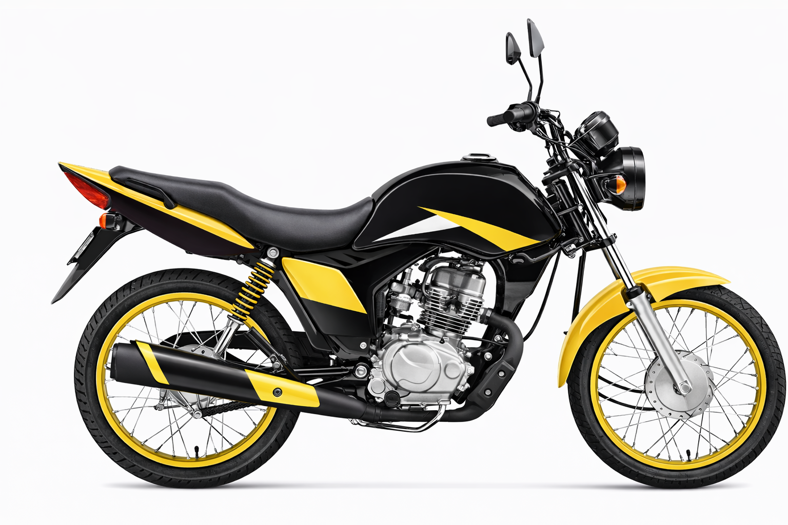

# MotoTrack – Controle de Manutenção de Motos

MotoTrack é um sistema de controle de manutenção de motos, permitindo gerenciar peças, acompanhar o histórico de trocas e receber alertas quando uma peça precisa ser substituída. O projeto é ideal para entusiastas de motos, oficinas mecânicas e como portfólio de desenvolvimento fullstack.

---

## 📌 Funcionalidades

- Dashboard com visualização das peças da moto.
- Registro de manutenção realizada em cada peça.
- Histórico de trocas por peça.
- Alertas de manutenção baseado em quilometragem ou tempo.
- Exportação de relatórios em Excel/PDF (planejado).
- Suporte a múltiplas motos por usuário (opcional futuro).

---

## 🛠 Tecnologias

- **Frontend:** React / Angular (com TailwindCSS ou Bootstrap)  
- **Backend:** Python (FastAPI ou Flask) ou Node.js (Express)  
- **Banco de dados:** SQLite / MySQL  
- **Extras:** Gráficos de status com Chart.js / Recharts  

---

## 📁 Estrutura do projeto

